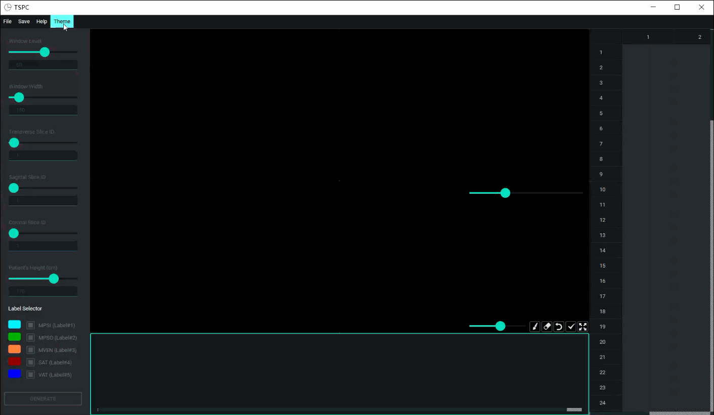
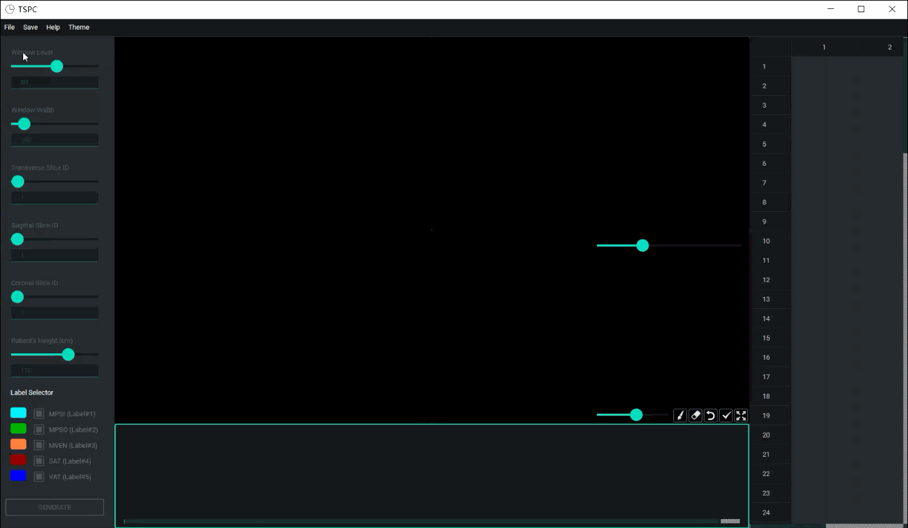
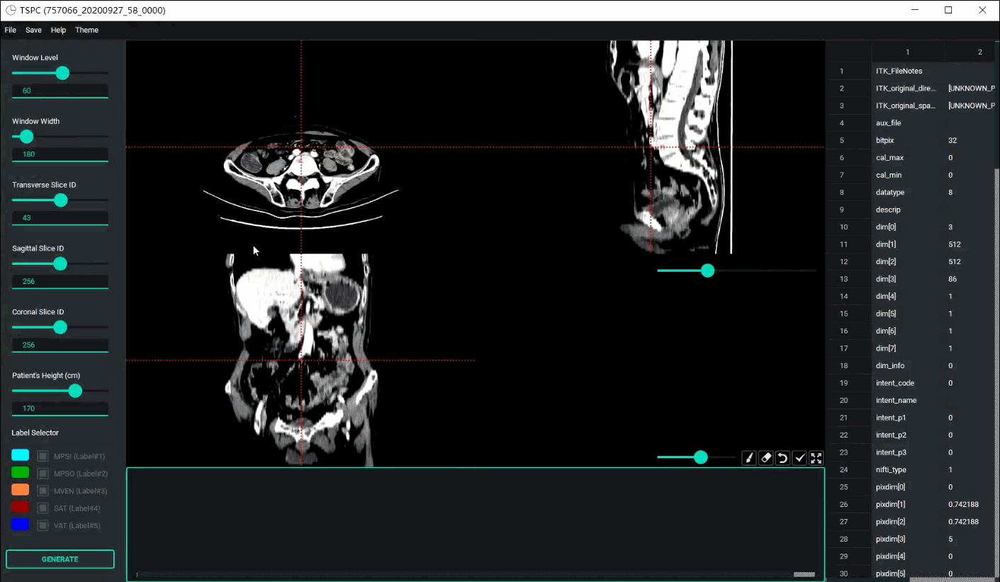
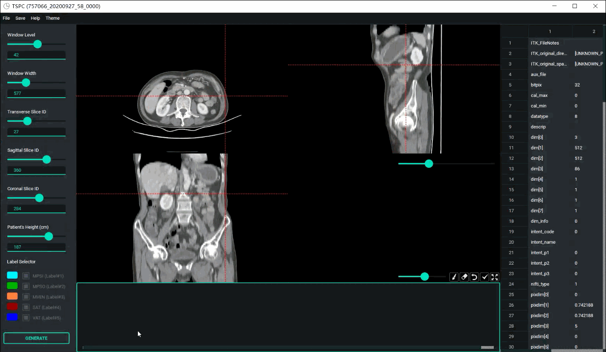
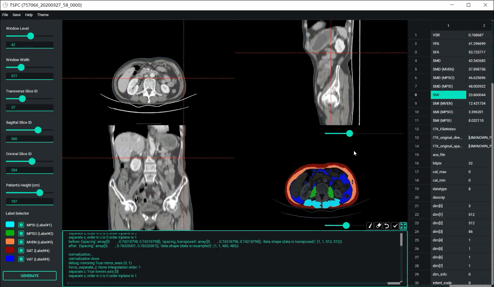

# Peking_University_Body_Component_Calculator: An Automatic Tool for Tissues Segmentation and Parameters Calculation

Note: the current version is not yet a stable version, only preliminary testing on the window10 platform with CPU, and will continue to be improved in the future.

## Quick starts

### Requirements
- nnUNet
- PyTorch
- PyQt5

All packages can be installed by the following command:
```
pip install -r requirements.txt
```

### Pretrained Models
The pretrained models can be downloaded from [Baidu Disk](https://pan.baidu.com/s/1mZAOUanQPBp6GMh8olZDTA) (code: v5dx). Put them into the main folder.

### Run the Tool
Click Peking_University_Body_Component_Calculator.exe (downloaded from [Baidu Disk](https://pan.baidu.com/s/1tN2avLnp0RLhX5HVIJERAw?pwd=weyt)) to run the tool or run in the Shell:
```
python main.py
```

## Display

### Theme Switch


### Open File


### Parameter Adjustment


### Automatic Tissues Segmentation and Parameters Calculation


### Manual Interaction Correction


## References
- [nnUnet](https://github.com/MIC-DKFZ/nnunet)
- PyQt5